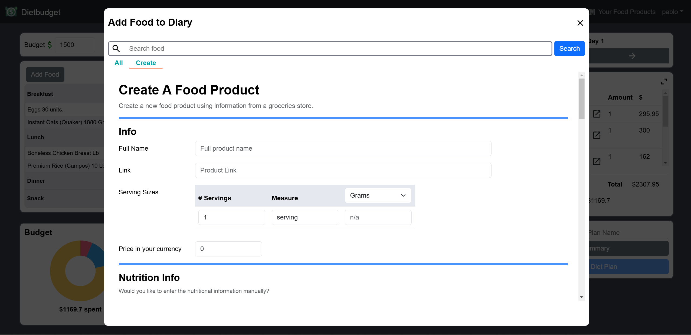
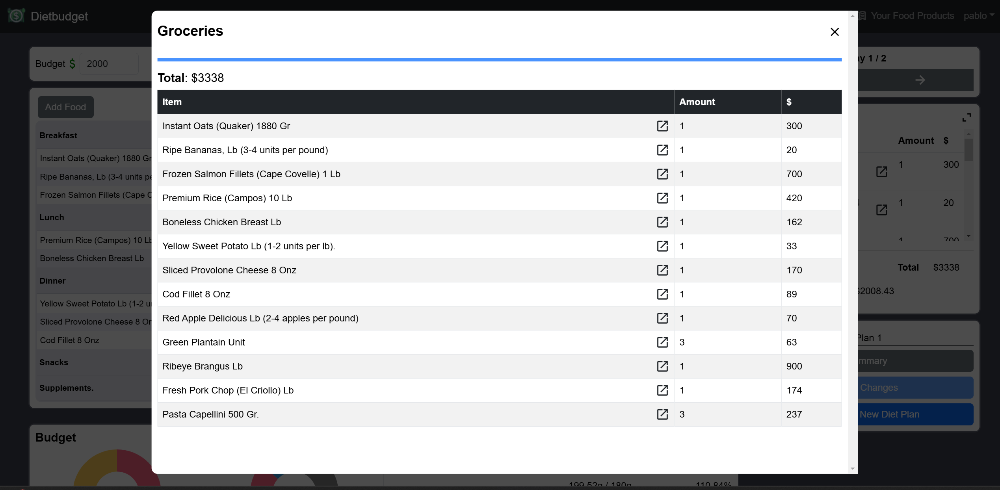

# Dietbudget

DietBudget is an app that helps users plan their diet, track nutritional goals, and manage food expenses while staying within their budget.
 It allows users to create and manage personalized food products,
set daily calorie and nutrient targets, and create diet plans for efficient meal planning.

## Demo
[Watch the Demo on YouTube](https://youtu.be/H-SSeoF1R4E)

## Features

- **User Accounts**: Sign up or sign in to access personalized diet plans.
- **Food Product Management**: Add, edit, delete, and search for food products.
- **Nutritional Tracking**: Automatically retrieve nutritional information from the USDA Food API or manually input data in order to create food products to be used in your diet plan.
- **Meal Planning**: Create and customize meals for each day of your diet plan.
- **Budget Tracking**: Set and track food budgets, view the cost of each food serving, meal, day and the entire diet plan.
- **Groceries List and Groceries total cost**: Each diet plan has an automatically created groceries list, this list indicates how many items of each food product found in the diet plan need to be bought. The groceries list total cost includes the leftovers, which is different from the diet plan total cost which only amounts to the food consumed.
- **Diet plan summary**: You can get a summary of a diet plan detailing the meals and its food servings on each day.

## Technologies Used and Explanation

- **Backend**: Django (Rest Framework)
- **Frontend**: React
- **Database**: SQLite
- [USDA Food API](https://www.ers.usda.gov/developer/data-apis/)

### Backend
The backend is built on Django and the Django Rest Framework, this backend provides the application main API, this API manages:
- User authorization and authentication based on **JWT Tokens**.
- Diet plans CRUD operations.
- Food products CRUD operations.
- **Food nutritional information search functionality**: The USDA Food API is utilized here to fetch multiple foods and their nutritional information registered in the USDA Food database.

### Frontend
The frontend provides an intuitive and complete UI, which help users create their diet plans, you can see screenshots of this UI in the [screenshots](#screenshots) section.

## Distinctiveness and Complexity
This app is distinctive from other meal tracking apps by incorporating both nutritional tracking and budget management. I believe diets should not
be created based only on assigning high nutrient foods to each meal without taking in consideration the user's financial constraints. This app allows users to create their diet plans that not only gives them nutritional
information but also financial information. This allows them to keep track of their expenses and compare different diet plans and choose what gives them more bang for their buck.

The app’s architecture is complex, particularly on the frontend. Built on react the frontend has more thant 30 components and multiple lines of code.
The frontend is designed needs to manage multiple API requests, and also provide an intuitive and complete UI that allows users to create their diet plans, these require
multiple states, hooks and api fetches. Also i needed to create my own css files because of the complexity of the UI.

On the other hand the backend was a bit easier, but still complicated, specially integrating the USDA Food API to the project was a challenge, because it required to clean and format the response data. 
Also, the diet plan saving function was complicated to integrate, these required 5 different models in order to create and update a single diet plan. The view to send the diet plan
to the frontend required a lot of cleaning and formatting by both ends. Finally there are multiple API endpoints and views in the `/diet` app, which handle food product CRUD operations (these food products are related
to an unique identifier in the USDA database also this food products are related to another model which holds their nutritional information), food search functionality,
and diet plan CRUD operations (which require 5 models in order to create a single diet plan, these diet plans have a relationship with the food products model).

The most complex thing was taking this unique idea into reality, i faced many design challenges because this is not a common app idea, the design and functionality needed to be carefully considered and planned.
The app had to provide not only nutritional information but also allow for easy tracking of food expenses, all while maintaining an intuitive user experience.
The relationship and interaction between various components had to be thoroughly analyzed to ensure they complemented each other and created a cohesive experience for the user.

## Files Explanation

### /backend
This directory contains the backend of the application, built with Django. The **/project** folder includes general settings for the project, as well as utility functions and constants that are used across various parts of the application.

#### /accounts
The **/accounts** app manages the user model and handles authentication and authorization processes. It is responsible for features like setting daily nutritional targets, managing user preferences, and retrieving user-specific default settings to display on the frontend.

#### /diet
The **/diet** app manages the core functionality of the application, including models for `FoodProduct`, `DietPlan`, `NutritionData`, and other essential data structures. It is responsible for key operations such as searching for food items in the USDA Food API, creating diet plans, and tracking food and nutrient data. The views in this app handle user interactions related to food selection and diet plan creation.

### /frontend

#### /src
The **/src** folder contains the main source code for the frontend, where the app is built using React. The entry point for the frontend is **App.jsx**, and the application’s styles are located in the **/styles** folder, which holds the CSS files.

#### /src/components
The **/components** folder contains all the React components for the frontend. Related components are grouped into subfolders based on their functionality. For example, all components related to the "diary" feature are found in the **/components/diary/** folder. Components that are used across different sections of the app, such as **Modal.jsx** and **NavBar.jsx**, are placed in the root of the **/components** folder as they are shared across multiple pages and contexts.

#### /src/pages
The **/src/pages** folder contains the React components that are rendered when visiting specific routes in the app. These components correspond to the different pages users interact with. The routes for these pages are defined in **src/App.jsx**, inside a **<BrowserRouter />** component that maps URLs to the appropriate page components.

#### /src/api.js
The **api.js** file in **/src** defines an Axios instance, which is used to make API calls throughout the project. This instance is configured to automatically include the JWT token in the authorization header for secure communication with the backend.

#### /src/constants.js
The **constants.js** file in **/src** defines various constants that are used throughout the frontend. These constants help maintain consistency across the application and make it easier to update values that are referenced in multiple places.

#### /src/lib
The **/src/lib** folder contains utility functions and variables that are used throughout the project. These helper functions are designed to streamline common tasks and make the codebase more modular and maintainable.

## Screenshots

### Index Page
On this page users can create and customize their diet plans.


### Add Food to Diary Modal.
On this modal there are two tabs.
1. **All**: The user's food products are displayed, these can be added to the diary, edited or deleted.
2. **Create**: Here the user can create a food product and save it to their food products private list.


### Nutritional Targets.
Displayed at the bottom of the index page, it shows the total nutrients on each day when there's not selected food or meal. When a food serving is selected it shows only the nutritional contributions of that food serving, when a meal is selected it shows the nutritional contribution of that meal.


### Groceries list.
The groceries list shows the food products we need to buy and the quantities required, along with the total cost.
This total cost includes leftovers, so it differs from the diet plan’s total cost, which only accounts for the cost of what’s actually consumed.


### Diet Plan Summary.
A summary of the entire diet plan. Detailing each day and its corresponding meals.


## Installation

### Prerequisites

Before running the app, make sure you have the following:

- Python (for the backend)
- Node.js and npm (for the frontend)
- An API key from the [USDA Food API](https://www.ers.usda.gov/developer/data-apis/#apiForm)

### Backend Setup

1. Clone the repository:
    ```bash
    git clone https://github.com/PabloLorenzo123/DietBudget.git
    ```

2. Navigate to the project directory:
    ```bash
    cd DietBudget/backend
    ```

3. Create a virtual environment:
    ```bash
    python -m venv venv
    ```

4. Activate the virtual environment:
    - On Windows:
      ```bash
      .\venv\Scripts\activate
      ```
    - On macOS/Linux:
      ```bash
      source venv/bin/activate
      ```

5. Install Python dependencies:
    ```bash
    pip install -r requirements.txt
    ```

6. Create a `.env` file in the `/backend` directory and add your USDA API key:
    ```env
    USDA_API_KEY=your_api_key_here
    ```

7. Run migrations to set up the database:
    ```bash
    python manage.py makemigrations
    python manage.py migrate
    ```

8. Run the Django development server:
    ```bash
    python manage.py runserver
    ```

### Frontend Setup

1. Navigate to the frontend directory:
    ```bash
    cd ../frontend
    ```

2. Install npm dependencies:
    ```bash
    npm install
    ```

3. Run the React development server:
    ```bash
    npm start
    ```

## Usage

1. Open the app in your browser at `http://localhost:3000`.
2. Sign up or sign in to create and manage your diet plans.

## License

This project is licensed under the MIT License - see the [LICENSE](LICENSE) file for details.

## Contact

Created by [Pablo Lorenzo](https://github.com/PabloLorenzo123).
